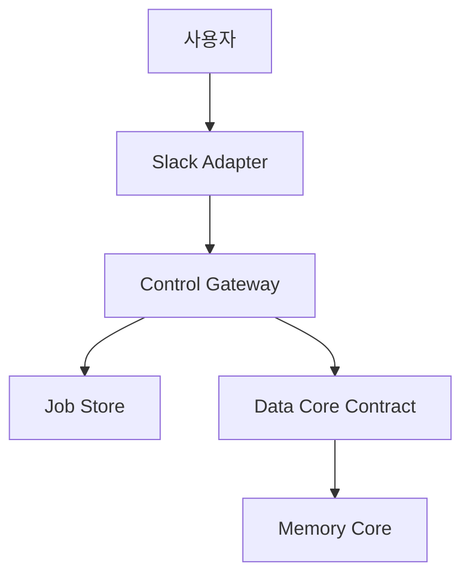
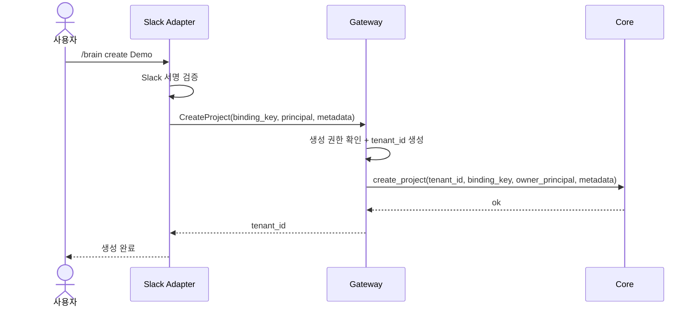
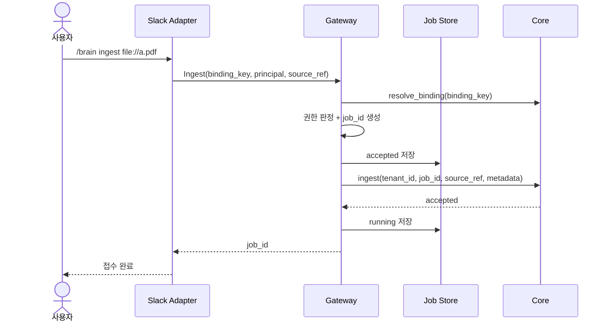
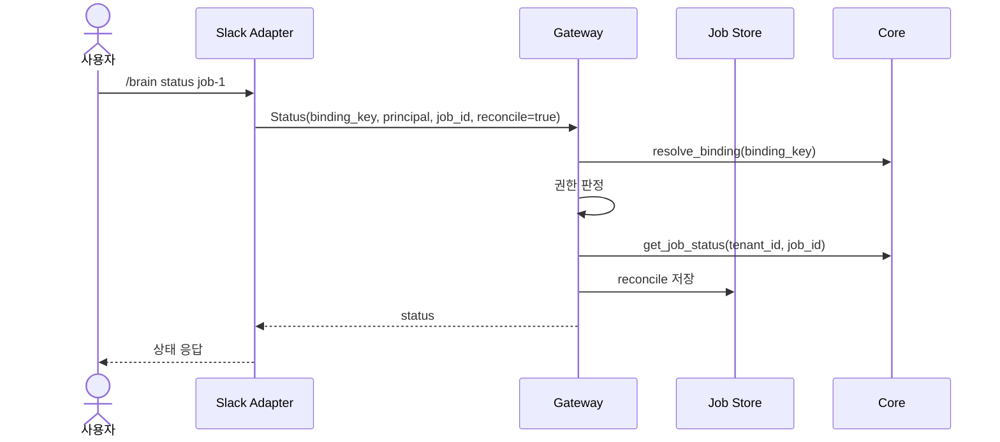

# workspace-brain 아키텍처

이 문서는 현재 Go walking skeleton이 어떤 아키텍처 결정을 코드로 고정하는지 설명합니다. 상세 설계는 `docs/` 아래 문서를 기준으로 하고, 이 파일은 구현 관점의 빠른 지도를 제공합니다.

## 한 줄 요약

workspace-brain은 **표면 어댑터 → 공통 게이트웨이 → 표면 무관 데이터 코어**로 나뉘는 멀티테넌트 RAG 플랫폼입니다.

핵심 원칙은 다음입니다.

> **Data Core는 호출자가 Slack인지, Web인지, CLI인지 모른다.**

Slack channel, `response_url`, slash command, block kit 같은 표면 고유성은 adapter에 가둡니다. Core는 `tenant_id`, `job_id`, `source_ref`, `question` 같은 표면 무관 값만 받습니다.

## 계층 구조

## 현재 Go 패키지 매핑

| 패키지 | 책임 |
|---|---|
| `pkg/brainapi` | Control Plane과 Data Core가 공유하는 표면 무관 계약 |
| `internal/control/gateway` | binding 해석, 권한 판정, job 생성, Core 호출 |
| `internal/control/jobs` | Control Plane 자체 job 상태 저장소 |
| `internal/control/slack` | Slack slash-command HTTP adapter |
| `internal/core/memory` | 테스트/데모용 in-memory Data Core |
| `cmd/workspace-brain` | 서버/데모 실행 진입점 |

## 요청 흐름

### `/brain create`

구현 위치:

- `internal/control/slack/handler.go`
- `internal/control/gateway/gateway.go`
- `internal/core/memory/core.go`

### `/brain ingest`

중요 결정:

- `job_id`는 Gateway가 생성합니다.
- Core는 전달받은 `job_id`를 멱등성 키와 callback 식별자로 사용합니다.
- Control Plane은 Core와 별개로 UX용 job state를 저장합니다.

### `/brain status`

## 보안/격리 원칙

현재 skeleton에서 테스트로 고정한 원칙입니다.

1. **binding 존재 여부와 권한 없음은 외부 표면에 구분해서 노출하지 않는다.**
   - Gateway는 `binding not found`와 `unauthorized`를 safe access error로 정규화합니다.

2. **job 상태는 `(tenant_id, job_id)` 범위로 조회한다.**
   - 같은 `job_id`라도 tenant가 다르면 다른 작업입니다.

3. **Core는 surface identity를 직접 판단하지 않는다.**
   - Core는 이미 검증된 `tenant_id`만 신뢰합니다.
   - `resolve_binding`만 tenant 해석용 preflight 예외입니다.

4. **Slack 요청은 signature 검증 후 처리한다.**
   - timestamp freshness와 HMAC SHA-256 signature를 검증합니다.

## 테스트 전략

| 범주 | 예시 |
|---|---|
| Contract validation | binding key, tenant id, job id 검증 |
| Gateway security | missing binding / unauthorized safe error 정규화 |
| Job lifecycle | accepted → running → completed/failed |
| Tenant isolation | tenant별 source/job 분리 |
| Slack adapter | signature 검증, command dispatch, safe message |
| Race safety | in-memory store/core mutex 기반 동시 접근 |

## 확장 계획

현재 구현은 외부 의존성이 없는 skeleton입니다. 다음 단계에서는 interface 뒤에 실제 adapter를 붙입니다.

| 영역 | 현재 | 다음 단계 |
|---|---|---|
| 데이터 저장 | `internal/core/memory` | PostgreSQL + RLS |
| 벡터 저장 | 없음 | Qdrant tenant collection |
| 큐 | 없음 | RabbitMQ + DLQ |
| 임베딩 | 없음 | OpenAI `text-embedding-3-large` adapter |
| Slack | slash-command handler | manifest-as-code + interactivity |
| Admin | 없음 | 최소 web/admin command |

## 관련 문서

- `docs/workspace-brain-control-plane-architecture.md`
- `docs/workspace-brain-data-architecture.md`
