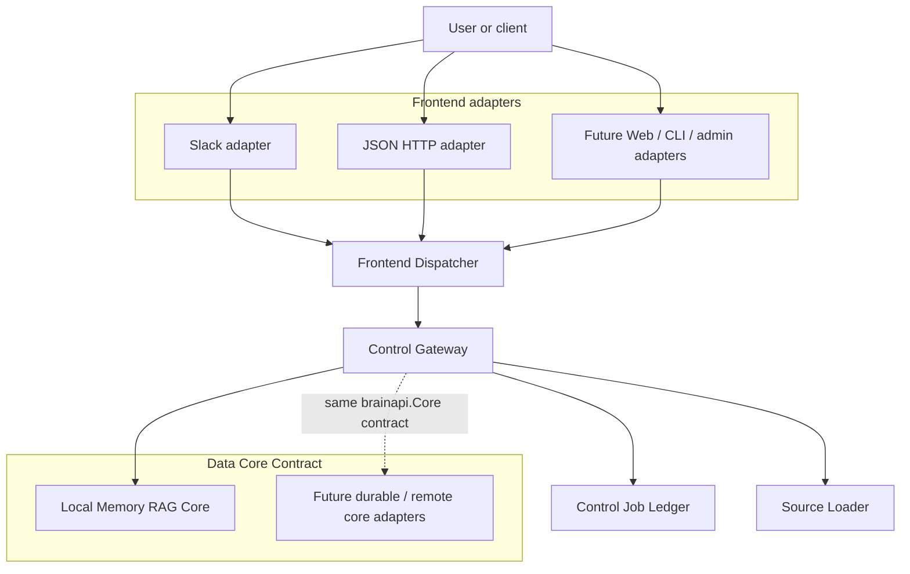
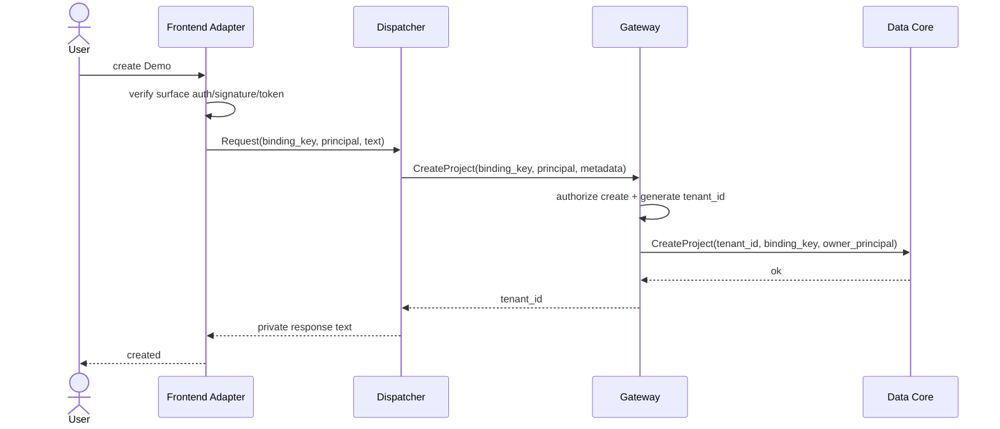
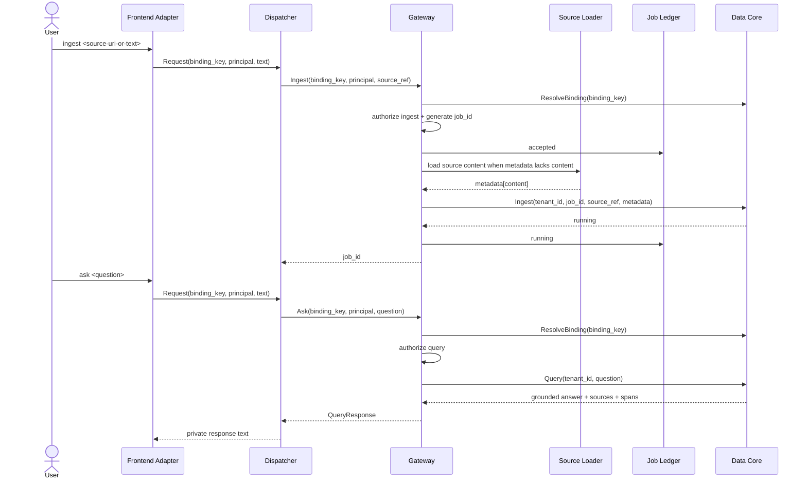
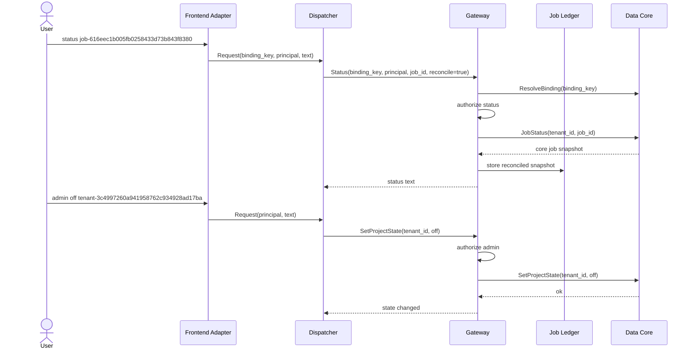

# workspace-brain Architecture

workspace-brain separates user-facing surfaces from tenant-scoped RAG data operations.

The boundary rule is strict:

> Slack is one frontend adapter. Gateway and Data Core do not know whether a request came from Slack, JSON HTTP, Web, CLI, or an admin UI.

The current runtime implements a surface-neutral command gateway, a local memory core, and adapter boundaries for Slack and token-protected JSON HTTP. Future surfaces attach at the same frontend adapter seam.

## Layer model

| Layer | Current implementation | Responsibility |
|---|---|---|
| Frontend adapter | `internal/control/slack`, `internal/control/httpapi` | Verify surface-local authentication, normalize identity and location, call the dispatcher, render a surface response. |
| Frontend dispatcher | `internal/control/frontend` | Parse shared text commands and call gateway methods. It owns command grammar, not tenant policy. |
| Control gateway | `internal/control/gateway` | Resolve bindings, authorize actions, generate `tenant_id`/`job_id`, load source content when needed, normalize safe access errors, and reconcile job status. |
| Control job ledger | `internal/control/jobs` | Keep in-memory UX job state under `(tenant_id, job_id)` and reconcile it with core job status. |
| Data core contract | `pkg/brainapi` | Define surface-neutral tenant, binding, source, query, discovery, job, and project-state types. |
| Local memory core | `internal/core/memory` | Provide the committed local RAG runtime and optional JSON snapshot persistence. |
| Platform | `internal/platform/config`, `internal/platform/server` | Parse process configuration and run the hardened HTTP server. |

## Boundary responsibilities

| Boundary | Responsibility | Must not do |
|---|---|---|
| Frontend adapter | Verify surface-specific auth, create `Principal`, create `BindingKey`, pass text command to the dispatcher | Decide tenant authorization, call Data Core directly, leak Slack/Web/CLI-only fields downstream |
| Frontend dispatcher | Parse `create`, `ingest`, `ask`, `discover`, `status`, and optional `admin` commands; render surface-neutral response text | Know Slack signatures, own tenant/job state, synthesize RAG answers |
| Control gateway | Resolve bindings, authorize actions, generate IDs, run source loading, call `brainapi.Core`, normalize access errors | Know Slack/Web payloads, parse HTTP/Slack requests, synthesize RAG answers |
| Job ledger | Store control-plane async job state for user-facing status and reconciliation | Store tenant source content or grounded chunks |
| Source loader | Resolve bounded ingest content from supported source references | Make tenant authorization decisions or persist core data |
| Data Core | Manage tenant-scoped project state, ingest, retrieval, answer/discovery, and core job state | Know which frontend adapter called it, trust unscoped identity, render surface-specific UI |

## Package map

| Package | Role |
|---|---|
| `pkg/brainapi` | Surface-neutral contract shared by Control Gateway and Data Core. |
| `internal/control/frontend` | Shared command dispatcher and optional admin capability seam. |
| `internal/control/gateway` | Binding resolution, authorization, source loading, job orchestration, and safe errors. |
| `internal/control/jobs` | In-memory control-plane job ledger with core reconciliation. |
| `internal/control/sources` | Bounded `file`, `http`, `https`, `text`, `raw`, inline metadata, and fallback text source loader for ingest metadata. |
| `internal/control/httpapi` | Bearer-token JSON frontend adapter at `/api/commands`. |
| `internal/control/slack` | Slack signature verification, slash command handling, interactivity acknowledgement, and manifest-as-code. |
| `internal/control/ops` | Health and readiness HTTP endpoints. |
| `internal/core/ai` | Optional local and OpenAI-compatible provider seams; not required by the default memory runtime. |
| `internal/core/memory` | Local-first in-memory RAG implementation with optional JSON snapshot persistence. |
| `internal/platform/config` | Typed environment parsing and validation. |
| `internal/platform/server` | HTTP server construction and graceful shutdown helper. |
| `cmd/workspace-brain` | Runtime wiring, HTTP route registration, and demo flow. |

## Identity and binding model

- `Principal` is adapter-created identity, for example `slack:U123`, `web:U1`, or `cli:alice` via `Principal{Source, ID, Roles}`.
- `BindingKey` is adapter-created location, for example `slack:channel:C123`, `api:workspace:demo`, or `web:space:S1`.
- `TenantID` is generated by the gateway during project creation as a random hex string, for example `tenant-3c4997260a941958762c934928ad17ba`.
- `JobID` is generated by the gateway for ingest work as a random hex string, for example `job-616eec1b005fb0258433d73b843f8380`.
- Data Core receives `TenantID`; it does not inspect Slack channels, HTTP sessions, or CLI arguments.
- Missing binding and unauthorized access collapse to the same safe access error at the gateway/frontend boundary.

## Command flow

### Create project

### Ingest and query

### Status and admin state

## Frontend adapter contract

A frontend adapter owns surface mechanics and stops them at the adapter boundary.

Adapter input responsibilities:

1. Authenticate the surface request.
2. Create a `brainapi.Principal` with source-qualified identity and roles.
3. Create a `brainapi.BindingKey` for the surface location.
4. Put the user command in `frontend.Request.Text`.
5. Call `frontend.Dispatcher.Handle`.

Adapter output responsibilities:

1. Convert `frontend.Response.Visibility` to the surface equivalent.
2. Render `frontend.Response.Text` or `frontend.SafeMessage(err)`.
3. Map transport-level success/failure without exposing tenant existence.

Current adapters:

| Adapter | Route | Authentication | Binding example | Principal example |
|---|---|---|---|---|
| Slack | `POST /slack/commands` | Slack HMAC timestamp signature | `slack:channel:C123` | `Principal{Source:"slack", ID:"U123", Roles:["member", "admin"]}` |
| Slack interactivity | `POST /slack/interactions` | Slack HMAC timestamp signature | Not dispatched yet; acknowledges receipt | Not dispatched yet |
| JSON HTTP | `POST /api/commands` | `Authorization: Bearer <API_TOKEN>` | Caller-supplied `binding_key` | Caller-supplied `principal` JSON |

## Source loading

The gateway calls `internal/control/sources.Loader` before core ingestion when `Metadata["content"]` is absent.

Supported input forms:

| Form | Behavior |
|---|---|
| `file:///absolute/path.md` | Reads a local file, enforces the byte limit, and infers name/MIME where possible. |
| `http://...`, `https://...` | Performs a bounded GET with timeout and accepts only 2xx responses. |
| `text://hello`, `text:hello` | Uses URL-decoded inline text. |
| `raw://hello`, `raw:hello` | Uses URL-decoded inline text. |
| Metadata `inline_content`, `inline`, `raw`, or `text` | Uses the metadata value as source content. |
| Plain or unknown-scheme URI | Treats the URI string as text content. |

The default loader bounds reads to 1 MiB and network loads to 5 seconds.

## Auth and tenant isolation

- Adapter authentication proves the request came from a surface; it does not grant tenant access.
- Gateway authorization decides whether a `Principal` can perform an `Action` against a tenant or binding.
- The local `RoleAuthorizer` allows `admin` principals to do everything and allows `member` principals to read/write existing tenants. It requires `admin` for `create_project` and `admin` actions.
- `ResolveBinding` is the only preflight exception that maps a surface-neutral binding to a tenant ID.
- `SafeAccessError` hides the difference between missing binding, missing tenant, and unauthorized principal.
- Job state is always addressed as `(tenant_id, job_id)`.
- `SetProjectState(off)` freezes serving operations while preserving data.

Production policy should replace or harden `RoleAuthorizer` behind the same gateway seam.

## Persistence

Current committed persistence is local and explicit:

- Without `DATA_PATH`, the memory core and control job ledger are in process memory.
- With `DATA_PATH`, the server creates the directory and the memory core stores `$DATA_PATH/memory.json` through atomic JSON snapshot writes.
- The snapshot includes bindings, projects, core jobs, sources, and document content used to rebuild chunks on load.
- The control-plane job ledger remains in memory; `Status(..., Reconcile:true)` refreshes it from core `JobStatus`.

Roadmap/extension persistence decisions:

- durable control-plane job store
- durable tenant catalog and binding store beyond the local snapshot
- dedicated source, chunk, and vector stores
- backups, migrations, and multi-process concurrency controls

## Operational endpoints

`cmd/workspace-brain` registers endpoints according to configured adapters:

| Endpoint | Method | Mounted when | Purpose |
|---|---:|---|---|
| `/healthz` | GET | Always | Liveness. Does not check dependencies. |
| `/readyz` | GET | Always | Readiness. Checks `DATA_PATH` only when `READINESS_REQUIRED=true`. |
| `/api/commands` | POST | `API_TOKEN` is set | Token-protected JSON command adapter. |
| `/slack/commands` | POST | `SLACK_SIGNING_SECRET` is set | Slack slash command adapter. |
| `/slack/interactions` | POST | `SLACK_SIGNING_SECRET` is set | Slack interactivity acknowledgement endpoint. |
| `/slack/manifest.json` | GET | `SLACK_SIGNING_SECRET` and HTTPS `PUBLIC_BASE_URL` are set | Deterministic Slack app manifest JSON. |

The process refuses server mode when neither `SLACK_SIGNING_SECRET` nor `API_TOKEN` configures a frontend adapter. The `demo` subcommand bypasses HTTP serving and runs an in-process flow.

## Adding a new frontend adapter

A new adapter should live beside the current control adapters, for example `internal/control/web` or `internal/control/cli`.

Implementation checklist:

1. Accept and authenticate the surface request.
2. Normalize identity into `brainapi.Principal`.
3. Normalize location into `brainapi.BindingKey`.
4. Pass text commands into `frontend.NewDispatcher(gateway).Handle`.
5. Render `frontend.Response` for the surface.
6. Add route wiring in `cmd/workspace-brain` or a separate entrypoint.
7. Test auth failure, malformed input, safe access error rendering, and one successful command path.

Do not add tenant lookup, direct core calls, or surface-specific fields below the adapter boundary.

## Local Data Core

`internal/core/memory` provides the deterministic local RAG path:

1. `CreateProject` stores tenant catalog and binding state atomically.
2. `Ingest` stores source metadata, chunks text, indexes deterministic local embeddings, and records a running core job.
3. `Query` combines lexical overlap and vector cosine score, then returns grounded chunks, unique sources, grounded spans, and a synthesized answer.
4. `Discover` returns metadata only and never exposes chunk text.
5. `SetProjectState` freezes or re-enables tenant serving.
6. `WithPersistence` and `NewPersistent` provide optional atomic JSON snapshot persistence.

This local implementation is the development/runtime baseline. PostgreSQL, Qdrant, RabbitMQ, OpenAI, and OpenAI-compatible providers are production adapter seams, not boot prerequisites. The optional OpenAI-compatible client exists in `internal/core/ai`, but the default server path still uses the local memory core with the gateway source loader.

## Roadmap and production extension points

The repository contains seams, not complete SaaS-scale production infrastructure, for:

- secret loading beyond environment variables
- durable control-plane stores
- durable source/chunk/vector stores
- retry/DLQ worker execution for ingest
- outbound Slack follow-up messages and rich Block Kit rendering
- full Slack Events API or Workflow handling
- optional OpenAI/OpenAI-compatible or self-hosted model adapters
- audit logging, metrics, tracing, backups, and migrations
- Compose or orchestrator packaging around the committed Dockerfile

See [docs/deployment.md](./docs/deployment.md) for the readiness checklist.

## Verification strategy

Implemented behavior is covered by package tests for:

- contract validation and safe errors
- gateway authorization, source loading, job lifecycle, and reconciliation
- frontend dispatch
- Slack command, interaction, and manifest handling
- JSON HTTP command handling
- health/readiness handlers
- memory core query, discovery, project state, and persistence
- runtime configuration and HTTP server behavior
