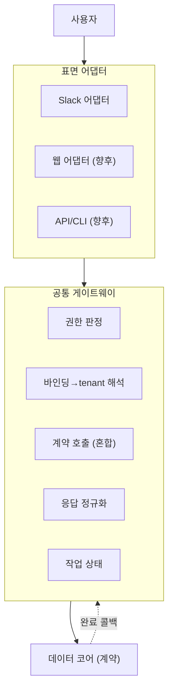
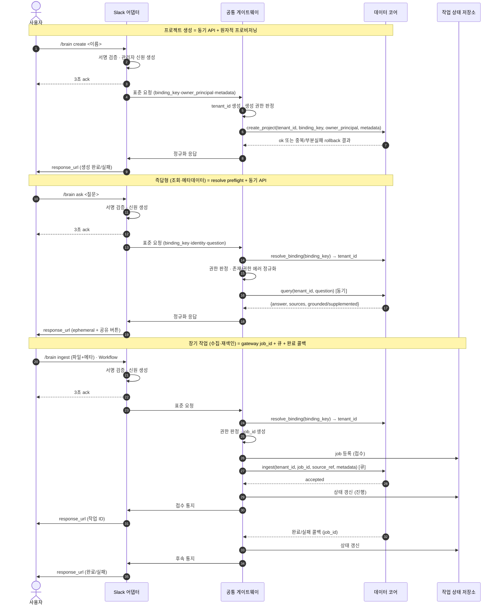

# workspace-brain Control Plane Architecture (제어 표면)

workspace-brain의 **제어 표면** 아키텍처. 사용자의 명령을 받아 데이터 코어의 계약(**workspace-brain Data Architecture** 5절)을 호출하는 어댑터 계층이다. 데이터 코어와 분리되어, Slack 외에 웹·API·CLI 같은 표면을 코어 변경 없이 붙일 수 있다.

핵심 원칙 — **코어는 호출자가 누구인지 모른다.** 표면 고유성(Slack 채널·response_url·block kit)은 표면 어댑터에 가두고, 공통 게이트웨이가 표면 무관 요청만 코어 계약으로 전달한다.

---

## 1. 3계층 구조

| 계층 | 책임 |
|------|------|
| **표면 어댑터** | 표면 고유 입력 수신, 신원 증명 생성, 표면 무관 키로 표준화, 표면 고유 응답 렌더링 |
| **공통 게이트웨이** | 권한 판정, 바인딩→tenant 해석, 코어 계약 호출(혼합), 응답 정규화, 작업 상태 관리 |
| **데이터 코어** | 표면 무관 계약 제공(별도 문서) |

---

## 2. 다중 표면 설계

처음부터 표면 무관 계약으로 설계하고, 지금은 Slack 어댑터만 구현한다. 표면이 늘어도 게이트웨이·코어는 불변이고, 새 어댑터만 추가한다.

- 표면마다 식별자가 다르다 — Slack은 채널 ID, 웹은 세션/선택, API는 명시적 키.
- 어댑터가 자기 식별자를 **표면 무관 바인딩 키**로 표준화(예: `slack:channel:C123`).
- "채널"이라는 Slack 개념은 어댑터에 갇히고, 게이트웨이는 "바인딩 키 → tenant"라는 일반 규칙만 안다.

---

## 3. 공통 게이트웨이

모든 표면이 반드시 통과하는 단일 관문.

- **바인딩 해석(계약 예외)** — 일반 코어 계약은 이미 해석된 `tenant_id`를 받지만, `resolve_binding(binding_key)`은 게이트웨이가 tenant를 얻기 위해 호출하는 **preflight 예외 계약**이다.
- **권한 판정(하이브리드)** — 어댑터가 만든 표준 신원으로 "이 신원이 이 tenant에 접근 가능한가"를 일괄 판정. 인증 수단 차이는 어댑터가 흡수. (민감 작업은 어댑터의 실시간 신원 갱신 정책으로 처리.)
- **존재/권한 에러 정규화** — 외부 표면에는 `binding 없음`과 `권한 없음`을 구분해 노출하지 않는다. 내부 감사 로그에만 원인을 기록한다.
- **계약 호출(혼합)** — 즉답형(`query`·`discover`)은 코어 동기 API, 장기 작업(`ingest`·재색인)은 큐 + 완료 콜백.
- **작업 상태 관리** — 게이트웨이가 표면 무관 `job_id`를 생성해 코어에 전달하고, 자체 상태 저장소에 UX 상태(접수/진행/완료/실패)와 코어 처리 상태를 매핑한다.
- **응답 정규화** — 코어의 표면 무관 결과(`{answer, sources, grounded/supplemented}`)를 어댑터가 렌더할 표준형으로 변환.

---

## 4. Slack 어댑터

**단일 Slack 앱**에 슬래시 커맨드·Events·Interactivity·Workflow를 모두 등록한다. 관리 권한 제한은 Slack scope가 아니라 게이트웨이 권한 판정으로 강제한다.

| 요소 | 역할 |
|------|------|
| 슬래시 `/brain` | `create`·`ingest`·`ask`·`discover`·`status` 서브커맨드 파싱 |
| Events API | 파일·이벤트 수신 |
| Interactivity | "채널에 공유" 버튼 등 버튼 액션 |
| Workflow | 폼 기반 수집 입력 → 동일 수집 경로로 수렴 |
| 서명 검증 | 모든 웹훅 진입부 |
| 3초 ack + `response_url` | 즉시 ack 후 후속 응답 |
| 신원 생성 | Slack 서명·멤버십 → 표준 신원(민감 작업만 실시간) |
| 렌더링 | block kit, 기본 ephemeral + 공유 버튼, 근거/보완 구분 표시 |

### 커맨드 이름 (COMMAND_NAME)

최상위 커맨드 이름은 환경변수 `COMMAND_NAME`로 관리한다. 기본값은 **`brain`**(즉 `/brain`). 코드(라우팅·파싱·응답 메시지)는 이 값을 참조하고, Slack 매니페스트도 이 값에서 생성한다(manifest-as-code).

**등록 후 잠금** — Slack에 커맨드가 한 번 등록되면 런타임에서 이름을 바꿀 수 없다.

- 최초 등록 시점의 이름을 **잠금(lock)으로 영속 기록**한다.
- 부팅 시 `COMMAND_NAME`이 잠금에 기록된 이름과 다르면 **시작을 거부**한다(등록된 Slack 커맨드와 코드가 어긋나 커맨드가 미인식되는 사고 방지).
- 이름을 바꾸려면 환경변수만 바꾸는 게 아니라 **매니페스트 재등록을 포함한 명시적 재배포 절차**를 거쳐 잠금을 갱신한다.

서브커맨드(`create`·`ingest`·`ask`·`discover`·`status`)는 텍스트 인자라 별도 등록이 필요 없다. 사전 등록 제약이 없는 향후 표면(웹·API)은 이름을 더 자유롭게 둘 수 있다.

---

## 5. 코어 통신 (혼합)

> 장기 작업은 게이트웨이가 만든 표면 무관 `job_id`를 코어에도 전달한다. 코어 → 게이트웨이 **역방향 완료 콜백**은 빠른 UX를 위한 기본 경로이고, 콜백 유실 시 게이트웨이는 코어 `get_job_status`로 재동기화한다.

---

## 6. 에러·타임아웃 UX (풀)

혼합 통신에서 코어 지연·실패·콜백 유실에 대비한다.

- **접수 확인** — 장기 작업은 게이트웨이가 만든 작업 ID와 함께 "접수됨".
- **단계 알림** — 진행/완료/실패를 `response_url`로 통지.
- **타임아웃 보정** — 완료 콜백이 일정 시간 안 오면 먼저 코어 `get_job_status`로 재조회하고, 확인 불가할 때만 실패/확인필요 상태로 안내.
- **상태 조회** — `/brain status <작업ID>`는 Control Plane 상태 저장소를 우선 조회하고, stale 상태면 코어 상태와 reconcile한다.
- **재시도** — 실패 작업 재실행(동일 `job_id` 재사용 금지, 원본 작업 참조 + 신규 `job_id`; 코어 멱등성·DLQ와 연계).
- **상태 저장소** — 위를 위해 Control Plane이 작업 상태를 자체 영속 저장하되, 코어 처리 상태와 동기화 가능한 참조를 보관한다.

---

## 7. 결정 요약 (Control Plane)

| # | 항목 | 결정 |
|---|------|------|
| 1 | 코어 통신 | 혼합 (즉답=동기 API, 장기=큐+완료 콜백) |
| 2 | 표면 범위 | 처음부터 다중 표면 설계 (어댑터 + 공통 게이트웨이) |
| 3 | 채널→tenant 해석 | 공통 게이트웨이 preflight (`resolve_binding`, 표면 무관 바인딩 키) |
| 4 | 인증·권한 | 하이브리드 (신원=어댑터, 권한=게이트웨이, 존재/권한 에러 외부 정규화) |
| 5 | Slack 앱 | 단일 앱 (관리 권한은 게이트웨이가 강제) |
| 6 | 에러·타임아웃 UX | 풀 (gateway `job_id`·상태 조회·재동기화·재시도, 자체 상태 저장소) |

## 8. 슬래시 커맨드 세트

| 커맨드 | 용도 |
|--------|------|
| `/brain create` | 프로젝트 생성 + 채널 자동 바인딩 |
| `/brain ingest` | 데이터 수집 (Workflow와 동일 경로) |
| `/brain ask` | 질의 |
| `/brain discover` | 보조 교차 탐색 (메타데이터만) |
| `/brain status` | 작업 상태 조회 |

`/brain create`는 게이트웨이가 `tenant_id`를 생성하고, Slack 어댑터가 만든 `binding_key`와 표준 소유자 신원(`owner_principal`)을 함께 코어 `create_project`에 전달한다. 코어는 바인딩 중복, collection/schema 생성, catalog 등록을 한 원자적 프로비저닝 단위로 처리한다.

## 9. 미해결 / 가드레일

- **콜백 신뢰성** — 완료 콜백 유실 대비 타임아웃·`get_job_status` 재조회 정책의 주기·상한 결정 필요.
- **작업 상태 저장소 선택** — Control Plane 자체 경량 저장소(예: Redis/PostgreSQL) 결정 필요.
- **Admin 표면** — 최소 웹 + Slack 혼합으로 "가능" 수준만. 상세 후속.
- **응답 공유 버튼** — Slack interactivity 엔드포인트 필요.
- **신원 토큰 수명** — 멤버십 캐시 TTL과 민감 작업 실시간 검증 경계 정의.
- **생성 권한 정책** — 누가 `/brain create`를 실행할 수 있는지, workspace/admin/allowlist 기준 결정 필요.
