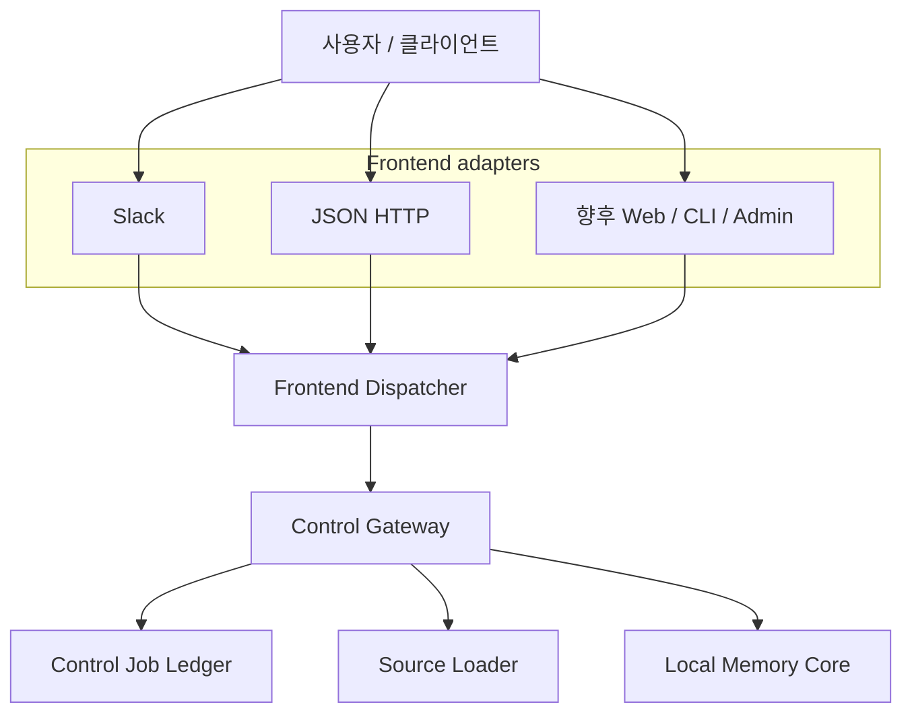
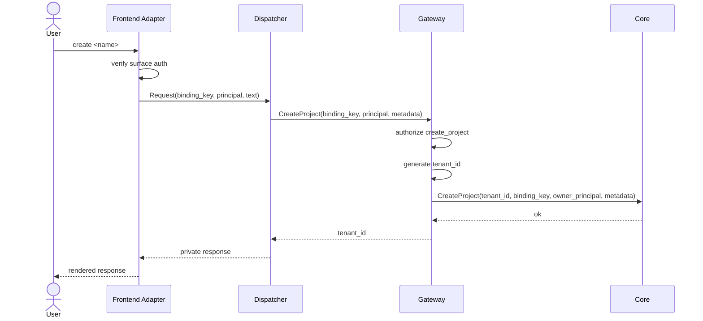
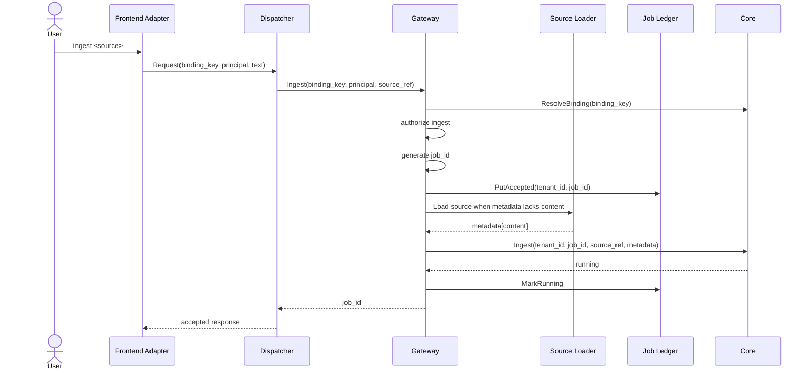
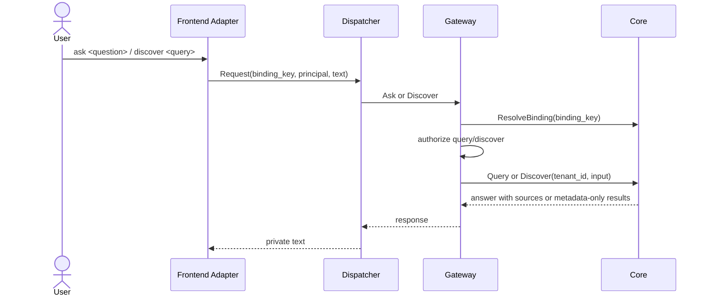

# workspace-brain Control Plane Architecture (제어 표면)

workspace-brain의 제어 표면은 사용자 명령을 표면 무관 요청으로 바꾸고 `brainapi.Core` 계약을 호출한다. Slack은 현재 구현된 frontend adapter 중 하나다. 핵심 구조는 **surface-neutral command gateway + local memory core + adapter boundary**다.

원칙: **코어는 호출 표면을 모른다.** Slack 채널, HTTP bearer token, 향후 Web/CLI 세션 같은 표면 정보는 adapter 안에서 `Principal`, `BindingKey`, `Text`로 정규화된다.

---

## 1. 계층 모델

| 계층 | 구현 패키지 | 책임 |
|------|-------------|------|
| Frontend adapter | `internal/control/slack`, `internal/control/httpapi` | 표면 인증, 신원·위치 정규화, dispatcher 호출, 표면 응답 렌더링 |
| Frontend dispatcher | `internal/control/frontend` | 공통 텍스트 커맨드 파싱과 gateway 호출 |
| Control gateway | `internal/control/gateway` | 바인딩 해석, 권한 판정, ID 생성, source loading, core 호출, safe error 정규화 |
| Job ledger | `internal/control/jobs` | `(tenant_id, job_id)` 기준 control-plane 작업 상태 저장과 core 상태 reconcile |
| Source loader | `internal/control/sources` | ingest source를 bounded content metadata로 변환 |
| Data core | `internal/core/memory`, `pkg/brainapi` | tenant-scoped local RAG, discovery, job status, project state, optional JSON snapshot |
| Platform | `internal/platform/config`, `internal/platform/server`, `internal/control/ops` | 환경 설정, HTTP server, health/readiness |

---

## 2. Package map

| Package | 현재 역할 |
|---------|-----------|
| `pkg/brainapi` | control plane과 data core가 공유하는 표면 무관 계약 |
| `internal/control/frontend` | `create`, `ingest`, `ask`, `discover`, `status`, `admin` 텍스트 커맨드 dispatcher |
| `internal/control/gateway` | authorization, binding resolution, source loading orchestration, job ID/tenant ID 생성 |
| `internal/control/jobs` | in-memory job ledger와 core `JobStatus` reconcile |
| `internal/control/sources` | `file`, `http`, `https`, `text`, `raw`, inline metadata, plain text source loader |
| `internal/control/httpapi` | `POST /api/commands` bearer-token JSON adapter |
| `internal/control/slack` | `POST /slack/commands`, `POST /slack/interactions`, manifest JSON 생성 |
| `internal/control/ops` | `/healthz`, `/readyz` |
| `internal/core/memory` | local in-memory RAG core와 optional `$DATA_PATH/memory.json` snapshot |
| `internal/core/ai` | optional local/OpenAI-compatible provider seam. 기본 server path에는 필요 없다. |
| `internal/platform/config` | 환경변수 파싱과 검증 |
| `internal/platform/server` | HTTP server와 graceful shutdown |
| `cmd/workspace-brain` | runtime wiring, route mount, demo flow |

---

## 3. Adapter contract

Adapter는 표면 고유 정보를 이 경계에서 멈춘다.

### Adapter가 해야 할 일

1. 표면 요청을 인증한다.
2. 표면 신원을 `brainapi.Principal{Source, ID, Roles}`로 만든다.
3. 표면 위치를 `brainapi.BindingKey`로 만든다.
4. 사용자 명령 텍스트를 `frontend.Request.Text`에 넣는다.
5. `frontend.Dispatcher.Handle`을 호출한다.
6. `frontend.Response` 또는 `frontend.SafeMessage(err)`를 표면 응답으로 렌더링한다.

### Adapter가 하면 안 되는 일

- tenant ID를 직접 해석하지 않는다.
- `brainapi.Core`를 직접 호출하지 않는다.
- Slack channel, HTTP header, Web session 같은 표면 필드를 gateway 아래로 넘기지 않는다.
- 존재하지 않는 binding과 권한 실패를 사용자에게 구분해 노출하지 않는다.

### 현재 adapters

| Adapter | Route | 인증 | BindingKey | Principal |
|---------|-------|------|------------|-----------|
| Slack slash command | `POST /slack/commands` | Slack HMAC timestamp signature | `slack:channel:<channel_id>` | `Source:"slack"`, `ID:<user_id>`, roles `member` plus configured `admin` |
| Slack interactivity | `POST /slack/interactions` | Slack HMAC timestamp signature | 현재 dispatcher로 전달하지 않고 접수만 응답 | 현재 dispatcher로 전달하지 않음 |
| JSON HTTP | `POST /api/commands` | `Authorization: Bearer <API_TOKEN>` | JSON body의 `binding_key` | JSON body의 `principal` |

---

## 4. Command flow

### 4.1 Project creation

`create`는 admin 권한이 필요하다. gateway는 `crypto/rand`를 이용해 `tenant-<32-hex-chars>` 형식의 무작위 ID를 생성한다.

### 4.2 Ingest

지원 source 형식:

- `file:///absolute/path`
- `http://...` and `https://...`
- `text://...`, `text:...`
- `raw://...`, `raw:...`
- metadata keys `inline_content`, `inline`, `raw`, `text`
- plain or unknown-scheme URI as text fallback

기본 loader는 1 MiB read limit과 5초 network timeout을 적용한다.

### 4.3 Query and discovery

`ask`는 grounded answer, sources, grounded spans를 반환한다. `discover`는 metadata만 반환하고 chunk text를 노출하지 않는다.

### 4.4 Status and admin

`status <job_id>`는 gateway에서 binding을 tenant로 해석하고 권한을 확인한 뒤 core `JobStatus`로 reconcile한다. 결과는 job ledger에 저장된다.

`admin on|off <tenant_id>`는 dispatcher의 optional admin capability를 사용한다. Gateway는 `admin` action을 authorize한 뒤 core `SetProjectState`를 호출한다. `off` 상태는 데이터를 보존하면서 serving 작업을 막는다.

---

## 5. Auth and tenant isolation

- Adapter authentication은 요청 출처를 검증한다.
- Gateway authorization은 `Principal`, `Action`, `TenantID`/`BindingKey` 조합을 검증한다.
- 현재 `RoleAuthorizer`는 `admin`에게 모든 권한을 주고, `member`에게 기존 tenant read/write 작업을 허용한다.
- `create_project`와 `admin` action은 `admin` role이 필요하다.
- `ResolveBinding(binding_key)`만 surface binding을 tenant로 바꾸는 preflight 예외다.
- Gateway는 not found와 unauthorized를 `SafeAccessError`로 통합한다.
- Job 상태는 항상 `(tenant_id, job_id)` scope로 저장·조회한다.

Production extension: role 정책, membership refresh, audit log, tenant allowlist는 같은 gateway seam 뒤에서 강화한다.

---

## 6. Persistence model

현재 구현은 local-first다.

| State | 현재 저장소 |
|-------|-------------|
| Binding catalog | memory core map, optional JSON snapshot |
| Project metadata/state | memory core map, optional JSON snapshot |
| Source refs and document content | memory core map, optional JSON snapshot |
| Chunks/vectors | in-memory rebuild from persisted docs |
| Core job status | memory core map, optional JSON snapshot |
| Control-plane job ledger | process memory only |

`DATA_PATH`를 설정하면 server는 디렉터리를 만들고 memory core가 `$DATA_PATH/memory.json`에 atomic JSON snapshot을 쓴다. `DATA_PATH`가 없으면 모든 상태는 프로세스 메모리에 남는다.

Roadmap/extension:

- durable control-plane job store
- external tenant/binding catalog
- durable source/chunk/vector stores
- migrations, backup, multi-process locks

---

## 7. Operational endpoints

`cmd/workspace-brain`는 설정된 adapter에 따라 route를 mount한다.

| Endpoint | Method | Mount condition | 현재 동작 |
|----------|--------|-----------------|-----------|
| `/healthz` | GET | 항상 | liveness JSON 반환. dependency check 없음 |
| `/readyz` | GET | 항상 | `READINESS_REQUIRED=true`이면 `DATA_PATH` 상태 확인 |
| `/api/commands` | POST | `API_TOKEN` 설정 | bearer-token JSON command adapter |
| `/slack/commands` | POST | `SLACK_SIGNING_SECRET` 설정 | Slack slash command adapter |
| `/slack/interactions` | POST | `SLACK_SIGNING_SECRET` 설정 | Slack signature 검증 후 접수 응답 |
| `/slack/manifest.json` | GET | `SLACK_SIGNING_SECRET` and HTTPS `PUBLIC_BASE_URL` 설정 | deterministic Slack app manifest JSON |

Server mode는 최소 하나의 frontend adapter를 요구한다. `SLACK_SIGNING_SECRET`과 `API_TOKEN`이 모두 없으면 설정 검증이 실패한다. `go run ./cmd/workspace-brain demo`는 HTTP adapter 없이 in-process demo flow를 실행한다.

---

## 8. Slack adapter details

Slack은 frontend adapter다. Slack 중심 제어 표면이 아니다.

현재 Slack 구현:

- slash command endpoint에서 method, body size, timestamp, HMAC signature를 검증한다.
- `COMMAND_NAME` 기본값은 `brain`이며 요청 command가 `/<COMMAND_NAME>`과 다르면 거부한다.
- channel ID를 `slack:channel:<channel_id>` binding으로 바꾼다.
- user ID를 `Principal{Source:"slack", ID:<user_id>, Roles:["member"]}`로 바꾼다.
- `ADMIN_USERS`에 포함된 Slack user ID에는 `admin` role을 추가한다.
- 응답은 현재 ephemeral text JSON으로 렌더링한다.
- interactivity endpoint는 서명 검증 후 "접수" 응답만 반환한다.
- manifest generator는 slash command와 interactivity URL을 포함한 JSON을 만든다.

Roadmap/extension:

- Slack Events API file intake
- Workflow form intake
- delayed `response_url` follow-up messages
- rich Block Kit rendering and share buttons
- registered-command lock file or deployment lock workflow

---

## 9. Adding a new adapter

새 adapter는 `internal/control/<surface>`에 두고 기존 dispatcher/gateway를 재사용한다.

체크리스트:

1. 표면 인증을 구현한다.
2. 표면 identity를 `brainapi.Principal`로 변환한다.
3. 표면 location을 `brainapi.BindingKey`로 변환한다.
4. user command를 `frontend.Request.Text`로 전달한다.
5. `frontend.NewDispatcher(gateway).Handle(ctx, req)`를 호출한다.
6. response visibility와 text를 표면 UX에 맞게 렌더링한다.
7. route wiring을 `cmd/workspace-brain` 또는 별도 entrypoint에 추가한다.
8. tests: auth failure, malformed request, safe access error, successful command path.

새 adapter는 core contract를 바꾸지 않는다.

---

## 10. Decision summary

| # | 항목 | 현재 결정 |
|---|------|-----------|
| 1 | 표면 모델 | Slack 단일 표면이 아니라 frontend adapter boundary |
| 2 | 공통 명령 처리 | `internal/control/frontend` dispatcher |
| 3 | tenant 해석 | gateway가 `ResolveBinding(binding_key)` preflight 수행 |
| 4 | 인증/권한 | adapter authentication + gateway authorization |
| 5 | source ingest | gateway source loader가 content metadata를 채운 뒤 core ingest |
| 6 | 작업 상태 | gateway job ID + in-memory job ledger + core status reconcile |
| 7 | persistence | local memory core, optional `$DATA_PATH/memory.json`; control job ledger는 in-memory |
| 8 | 운영 route | `/healthz`, `/readyz`, `/api/commands`, `/slack/commands`, `/slack/interactions`, `/slack/manifest.json` |
