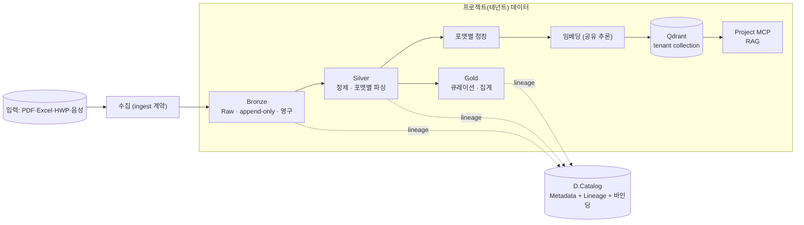
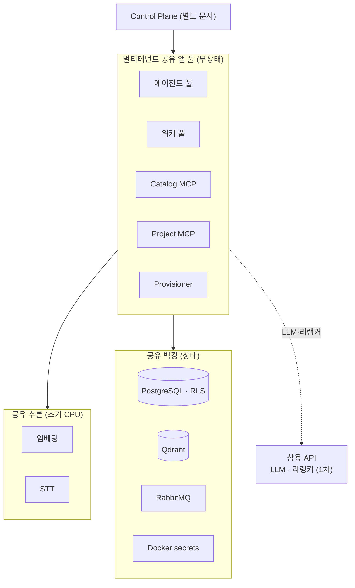
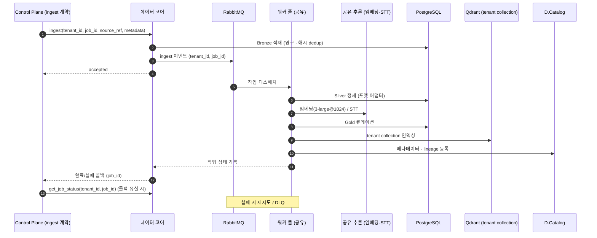
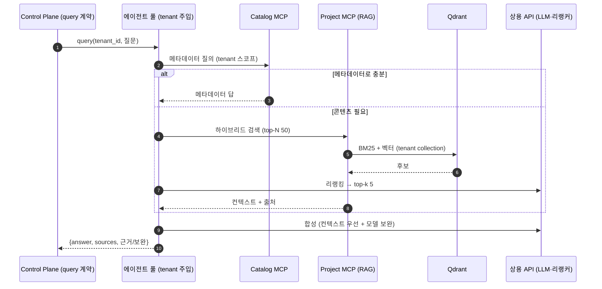

# workspace-brain Data Architecture (코어)

workspace-brain의 **데이터 코어** 아키텍처. 멀티 프로젝트 RAG 플랫폼의 저장·정제·검색·격리를 다룬다. Slack 등 제어 표면은 별도 문서(**workspace-brain Control Plane Architecture**)로 분리하며, 이 코어는 표면 무관 **계약(5절)** 만 노출한다.

규모 가정 — 등록 50+, **동시 활성 ~10**. 비활성은 데이터로만 존재(콜드). 배포는 Docker 단일 호스트로 시작, 무상태 공유 풀이라 멀티 호스트(Swarm)로 계획된 전환.

---

## 1. 핵심 개념

- **D.Platform** — 전체 플랫폼(Docker Host).
- **D.Lake** — 프로젝트(테넌트)별 데이터. Medallion 적용.
- **D.Catalog** — 메타데이터 + lineage + **바인딩 레지스트리**(표면 무관 키 → tenant).
- **테넌시** — 컨테이너를 프로젝트마다 복제하지 않는다. 공유 풀이 `tenant_id`를 주입받아 처리하고, 격리는 데이터 레벨에서 강제.

**MCP (두 종류, 멀티테넌트 공유)** — LLM 에이전트가 호출하는 도구 인터페이스.
- **Catalog MCP** — 데이터셋 존재·스키마·신선도·위치를 답하는 라우터. 메타데이터 질문은 여기서 종결.
- **Project MCP** — tenant collection만 검색해 원문 청크 반환(RAG).

---

## 2. 데이터 아키텍처 — Medallion

### 레이어 정의

| 레이어 | 성격 | 내용 |
|--------|------|------|
| **Bronze** | Raw · 불변 · append-only · **영구 보존** | 원천을 변형 없이 적재. 전체 이력·재처리 기반 |
| **Silver** | Cleansed · Conformed · **RAG 임베딩 소스** | 포맷별 파싱·정제·정합화. 원문 디테일 보존 |
| **Gold** | Curated · 집계 | 비즈니스 큐레이션. 정형 표는 구조화 질의(text-to-SQL) |
| **Serving** | 파생 | Silver 청킹 → 임베딩 → Qdrant tenant collection → Project MCP |

### 포맷별 청킹 (어댑터 패턴)

| 계열 | 포맷 | 처리 |
|------|------|------|
| 문서형 | PDF · HWP | 구조 기반 + 큰 청크는 고정 크기·오버랩 폴백. 스캔본 OCR 선행 |
| 표형 | Excel | 행 단위 직렬화 또는 구조화 질의(text-to-SQL) 분리 |
| 음성 | 오디오 | STT 전사 → turn/시간 윈도우 + 타임스탬프 메타 |

### 임베딩 (확정)

- **1차**: OpenAI `text-embedding-3-large`, MRL로 **@1024차원**.
- **2차(셀프호스트)**: **BGE-M3**(1024, dense+sparse 하이브리드 네이티브, 한국어 강함). 하이브리드 검색과 단일 모델로 정합.
- 차원을 1024로 통일해 전환 시 Qdrant collection 재설정 불필요(재임베딩은 필요하며 Bronze 영구 보존으로 가능).

### 저장·중복·아카이빙

- **저장**: PostgreSQL에 Bronze/Silver/Gold 스키마 분리. 벡터는 **Qdrant**, 프로젝트별 collection 물리 분리.
- **중복**: 정규화 텍스트 **해시 기반 중복 스킵**.
- **아카이빙(삭제 없음)**: Bronze 원본 유지, Silver/Gold/벡터에서 "아카이브됨" 표시로 검색 제외. 가역·복원 가능. (규제 강제 파기는 별도 예외)

---

## 3. 배포 아키텍처 — Docker 멀티테넌트

무상태 공유 풀이 모든 테넌트를 처리하고, 무거운 추론은 공유한다. 컨테이너 수가 프로젝트 수와 무관하게 상수.

> 계층 간 연결만 표시. 컴포넌트별 호출은 6·7절 시퀀스 참조.

### 자원·격리 요약

- **공유**: 에이전트/MCP/워커 풀, 추론(임베딩·STT), 백킹(PG·Qdrant·RabbitMQ).
- **GPU**: 초기 CPU + 필요시(STT 트리거).
- **유휴 회수**: 호출 시 TTL 8시간 핫 → 만료 시 콜드(데이터 보존). admin 오프 토글로 동결.
- **데이터 레벨 격리(5겹)**: Qdrant collection 물리 분리 · PostgreSQL RLS · `tenant_id` 미들웨어 강제 · 테넌트 스코프 토큰 · 누출 회귀 테스트. + 전용 격리 탈출구.
- **백업**: 전 계층(PG·Qdrant·Bronze) **오프호스트** 백업.

---

## 4. (생략 없음) 운영 라이프사이클

- **프로비저닝 = 테넌트 등록** — 게이트웨이가 생성한 `tenant_id`와 `binding_key`를 받아 collection·스키마·바인딩·catalog 레코드를 원자적으로 생성한다. 컨테이너 미기동, Docker 소켓 거의 불필요. 중복 생성 에러 반환, 부분 실패 롤백 필수.
- **관측·감사(표준)** — 운영 메트릭 + 구조화 로그 + 테넌트 감사 로그.
- **시크릿** — Docker secrets(Swarm에서 본격 작동). 테넌트 토큰 서명키 분리·수동 회전.

---

## 5. Platform Core Contract (경계)

코어가 노출하는 **표면 무관** 오퍼레이션. Control Plane(및 향후 표면)은 이 계약만 호출하며, 코어는 호출자가 누구인지 모른다. 대부분의 오퍼레이션은 호출 전에 이미 해석된 `tenant_id`를 받는다. 단, `resolve_binding`은 게이트웨이가 `tenant_id`를 얻기 위해 호출하는 preflight 예외 계약이다.

| 오퍼레이션 | 성격 | 시그니처(개념) |
|------------|------|----------------|
| `resolve_binding` | 동기 preflight | `(binding_key) → tenant_id` (바인딩 레지스트리 조회) |
| `create_project` | 동기 | `(tenant_id, binding_key, owner_principal, metadata) → ok` (테넌트 등록·바인딩 생성·프로비저닝) |
| `ingest` | **비동기(큐)** | `(tenant_id, job_id, source_ref, metadata) → accepted` |
| `get_job_status` | 동기 | `(tenant_id, job_id) → {status, result_ref?, error?}` (콜백 유실 재동기화용) |
| `query` | 동기 | `(tenant_id, question, opts) → {answer, sources[], grounded_spans, supplemented_spans}` |
| `discover` | 동기 | `(tenant_id, query) → metadata_results[]` (콘텐츠 차단) |
| `set_project_state` | 동기(admin) | `(tenant_id, on/off) → ok` |
| **완료 콜백** | 이벤트 | `job_completed(job_id, status, result_ref)` — 비동기 작업의 역방향 통지 |

> 즉답형(`query`·`discover`·`resolve_binding`·`get_job_status`)은 동기, 장기 작업(`ingest`)은 큐 + 완료 콜백. `job_id`는 Control Plane 게이트웨이가 생성한 표면 무관 작업 식별자이며, 코어는 이를 멱등성 키와 콜백 식별자로 사용한다. 이 혼합이 Control Plane과의 통신 규약(Control 문서 5절)과 짝을 이룬다.

---

## 6. 수집 흐름 (코어 관점)

---

## 7. 조회 흐름 (코어 관점)

> grounding(컨텍스트 우선 + 보완)과 출처(근거/보완 구분)는 코어가 결과에 담아 반환하고, **표시 방식**(ephemeral·공유 버튼 등)은 Control Plane이 정한다.

---

## 8. 보안 (코어 측)

- **격리** — 3절의 데이터 레벨 5겹. 코어는 항상 `tenant_id` 스코프로만 데이터에 접근.
- **신원·멤버십 검증은 코어 밖** — "누가 이 tenant에 접근 가능한가"는 Control Plane 게이트웨이가 판정하고, 코어는 검증된 `tenant_id`만 신뢰한다(테넌트 스코프 토큰). 단, `resolve_binding`은 tenant 해석을 위한 preflight 예외이며 외부 에러 표현은 게이트웨이가 정규화한다.
- **작업 격리** — `get_job_status`와 콜백 상태는 `(tenant_id, job_id)` 범위로 검증하며, job_id만으로 타 tenant 작업을 조회할 수 없다.
- **시크릿·관측·감사** — 4절.

---

## 9. 결정 요약 (데이터 코어)

| 영역 | 항목 | 결정 |
|------|------|------|
| 인프라 | 호스트 | 단일 시작 → 계획된 전환 |
| 인프라 | 벡터 스토어 | Qdrant (tenant collection) |
| 인프라 | 큐 | RabbitMQ (DLQ) |
| 인프라 | 시크릿 | Docker secrets |
| 데이터 | 저장 | 단일 스토어 스키마 분리 |
| 데이터 | Bronze | 영구 보존 |
| 데이터 | RAG 소스 | Silver |
| 데이터 | 청킹 | 포맷별 어댑터 (+Excel 구조화 질의) |
| 데이터 | 임베딩 1차 | OpenAI text-embedding-3-large @1024 |
| 데이터 | 임베딩 2차 | BGE-M3 (1024, 셀프호스트) |
| 데이터 | 중복 | 해시 중복 스킵 |
| 데이터 | 삭제 | 아카이빙만 |
| 검색 | 방식 | 하이브리드 + 리랭커 (N50·k5) |
| 검색 | 리랭커/LLM | 1차 상용 → 이후 셀프 |
| 조회 | grounding | 컨텍스트 우선 + 모델 보완 |
| 조회 | 출처 | 근거+보완 구분 |
| 자원 | 풀 | 멀티테넌트 공유 |
| 자원 | 추론 | 중앙 공유, 초기 CPU |
| 자원 | 유휴 회수 | TTL 8시간 + 오프 토글 |
| 운영 | 백업 | 전 계층 오프호스트 |
| 보안 | 관측·감사 | 표준 (메트릭+로그+테넌트 감사) |

> 제어 표면(Slack 등)·인증·UX 결정은 **workspace-brain Control Plane Architecture** 참조.
