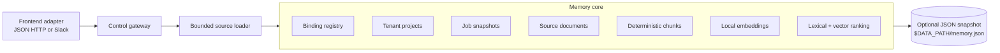

# workspace-brain Data Architecture (Core)

workspace-brain stores, indexes, and retrieves tenant-scoped project knowledge behind a surface-neutral core contract. The data core does not know whether a request came from JSON HTTP, Slack, or a future adapter. Adapters resolve authentication at the edge, the gateway passes validated `tenant_id` and `job_id` values, and the core enforces tenant-scoped data access.

This document separates the committed local implementation from future production storage adapters.

---

## 1. Current implementation

The committed runtime uses `internal/core/memory` as the development and local-operation baseline.



Implemented data responsibilities:

| Capability | Current behavior |
|---|---|
| Project creation | `CreateProject` stores a tenant project and a binding key atomically in memory. |
| Binding resolution | `ResolveBinding` maps a surface-neutral binding key to `tenant_id`. |
| Ingest | `Ingest` stores source metadata, creates deterministic chunks, indexes local embeddings, and records a tenant-scoped job snapshot. |
| Ask | `Query` ranks tenant chunks with lexical overlap plus vector cosine score and returns a grounded answer. |
| Discover | `Discover` returns metadata only. It does not expose chunk text. |
| Admin state | `SetProjectState` freezes or enables a tenant while preserving data. |
| Persistence | `NewPersistent` and `WithPersistence` load and write an atomic JSON snapshot when `DATA_PATH` is set. |

The current local core is deterministic. It does not require PostgreSQL, Qdrant, RabbitMQ, OpenAI, or Slack.

---

## 2. Tenant data model

The memory core stores all state under tenant scope:

- `bindings`: `binding_key -> tenant_id` registry.
- `projects`: tenant owner metadata and on/off state.
- `jobs`: asynchronous ingest state keyed by `(tenant_id, job_id)`.
- `sources`: source references accepted for each tenant.
- `docs`: source title, content, and freshness timestamp.
- `chunks`: derived text chunks, source references, local term vectors, and freshness metadata.

The core validates tenant and job identifiers before reads or writes. Query, discover, ingest, and job status lookup all require tenant scope. A disabled project returns a conflict for serving operations, but the data remains available for later re-enable or backup.

---

## 3. Source loading and ingest

The default server path wires `internal/control/sources.Loader` into the gateway before calling the core.

Supported source shapes:

| Source shape | Behavior |
|---|---|
| Existing metadata content | Preserves `Metadata["content"]` and skips loading. |
| Inline metadata | Uses `inline_content`, `inline`, `raw`, or `text` metadata as content. |
| `file://` | Reads a local file path. Non-local hosts are rejected. |
| `http://` and `https://` | Performs a bounded GET. Non-2xx responses fail ingest. |
| `text://` and `raw://` | Decodes URI text into content. |
| Plain text or unsupported scheme | Treats the input as text content. |

Safety guards:

- Default source size limit: 1 MiB.
- Default loader timeout: 5 seconds when the caller has no earlier deadline.
- Empty content fails ingest.
- Oversized sources fail before reaching the core.
- The loader fills missing text defaults such as source name or MIME type when available.

After loading, the gateway passes source content through `Metadata["content"]`. The memory core chunks the content in deterministic 48-word windows and indexes each chunk with a 16-dimension local term vector.

---

## 4. Retrieval and grounding

The current retrieval path stays local and deterministic:

1. Tokenize the question into normalized terms.
2. Build a local embedding vector with stable hashing.
3. Score each tenant chunk with lexical overlap and cosine similarity.
4. Return the top grounded chunks.
5. Build the answer from the highest ranked grounded chunk.
6. Return unique sources and grounded spans with the response.

`Query` sets `GroundingAvailable=true` when it finds tenant chunks. When no chunks exist, it returns a no-grounding answer and does not invent sources. `SupplementedSpans` is currently empty because the default path does not call an external synthesis provider.

`Discover` is intentionally metadata-only. It filters by metadata/content terms but returns only result ID, title, kind, and freshness timestamp.

---

## 5. JSON snapshot persistence

`DATA_PATH` enables local durable state:

```text
DATA_PATH=/var/lib/workspace-brain
snapshot=/var/lib/workspace-brain/memory.json
```

Runtime behavior:

- Server startup creates `DATA_PATH` with `0700` permissions.
- The memory core reads `$DATA_PATH/memory.json` if it exists.
- Mutations write an indented JSON snapshot through a temp file, `fsync`, atomic rename, and directory sync.
- Snapshot files are written with `0600` permissions.
- Snapshot version mismatches or decode errors make the core unavailable and surface typed internal errors.
- Chunks are derived state. On load, the core rebuilds chunks from persisted documents.

Use the JSON snapshot for local durability and restart-tolerant trials. Do not treat it as multi-node storage or a managed backup system.

---

## 6. Core contract boundary

The data core exposes surface-neutral operations:

| Operation | Purpose |
|---|---|
| `ResolveBinding(binding_key)` | Resolve a binding before tenant-scoped operations. |
| `CreateProject(tenant_id, binding_key, owner_principal, metadata)` | Create the tenant project and binding. |
| `Ingest(tenant_id, job_id, source_ref, metadata)` | Store and index source content. |
| `JobStatus(tenant_id, job_id)` | Read tenant-scoped job state. |
| `Query(tenant_id, question, opts)` | Return grounded answer, sources, and spans. |
| `Discover(tenant_id, query)` | Return metadata-only results. |
| `SetProjectState(tenant_id, on/off)` | Enable or freeze tenant serving. |

Slack is only one adapter example. Its channel, user, command, signature, and interactivity fields must not enter the core data model.

---

## 7. Future production adapters

The current implementation keeps production storage and retrieval systems behind replaceable seams. Add them only when the deployment needs their durability or scale.

| Area | Current baseline | Future adapter direction |
|---|---|---|
| Catalog and bindings | In-memory maps plus optional JSON snapshot | PostgreSQL or another durable catalog with tenant isolation. |
| Source and chunk storage | JSON-persisted documents; chunks rebuilt on load | Durable object/source store and chunk tables. |
| Vector search | Deterministic local term vectors | Qdrant or equivalent tenant-scoped vector store. |
| Ingest execution | Synchronous local indexing with job state | Queue-backed workers with retry and DLQ, such as RabbitMQ. |
| Embeddings | Local deterministic hashing | OpenAI-compatible or self-hosted embedding adapters with migration-controlled dimensions. |
| Synthesis | Grounded local answer from top chunk | Optional LLM synthesis that preserves grounded and supplemented span separation. |
| Observability | Health/readiness endpoints and tests | Metrics, audit logs, traces, backup alerts, and dependency readiness checks. |

Production adapters must preserve these invariants:

- Keep tenant scope on every read and write.
- Keep job state scoped by `(tenant_id, job_id)`.
- Keep discovery metadata-only.
- Keep grounded spans and source references attached to answers.
- Keep source content reproducible enough to rebuild indexes.
- Keep adapter-specific identity and rendering outside the data core.

---

## 8. Backup and restore implications

For the current local runtime, back up `$DATA_PATH/memory.json` and the deployment configuration that points to it. Restore by stopping the process, placing the snapshot at the same path, and starting the server again.

For future external stores, backup scope must include:

- tenant catalog and binding registry
- job ledger and ingest state
- source documents and chunk storage
- vector index state or reproducible source content for reindex
- adapter configuration and token/secret rotation records

Prefer restoring source and catalog state first, then rebuilding derived chunks and vector indexes. Treat vector indexes as rebuildable when source content is preserved.
